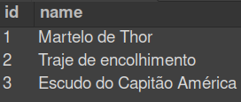

# Store Manager - uma API RESTful para mercados e lojas 🚀

## Desenvolvedor
**Nome**: Gabriel Cabral Melo <br>
**GitHub**: [gabecmelo](https://github.com/gabecmelo) <br>
**LinkedIn**: [Gabriel Cabral Melo](https://www.linkedin.com/in/gabrielc-melo/)

## Sobre a Aplicação
Este projeto consiste em uma API RESTful para gerenciamento de vendas. A aplicação oferece endpoints para listar, cadastrar, atualizar e deletar produtos, vendas, e possui funcionalidades adicionais como pesquisa de produtos por nome, exclusão de vendas, e atualização de quantidade de produtos em uma venda.

## Estrutura do Projeto
O projeto segue uma arquitetura em camadas, facilitando o desenvolvimento e manutenção. As principais camadas são: models, controllers, services e routes. Além disso, o projeto conta com testes unitários escritos cobrindo 60% das linhas de código, e 50% das mutações possíveis pela biblioteca stryker.

## Pré-requisitos
**Node.js** *16.14 ou superior* <br>
**Docker e Docker Compose** *para a execução dos contêineres*

## Como Iniciar a Aplicação

### Opção 1: Docker Compose
Instale as dependências: `npm install` <br>

Inicie os containers com: `docker-compose up -d` *(em média 140s para a primeira vez iniciando o container e 80s para as próximas)* <br>

Acesse a aplicação em: `http://localhost:3001` no navegador ou no client de sua escolha *(ex: Thunder Client, Postman, Insomnia...)*

### Opção 2: Localmente
Instale as dependências: `npm install`  <br>
Inicie apenas o serviço db com: `docker-compose up -d db` <br>
Inicie a aplicação em modo de desenvolvimento: `npm run dev:local` <br>

> ⚠️ Atenção: Ao rodar localmente, a aplicação deverá receber variáveis de ambiente como exemplificado em [`env.example`](./env.example) para poder se comunicar com o serviço de banco de dados.

## Comandos dos Testes:

```bash
#### Comandos dos testes do avaliador
npm run lint          # Verificação do linter
npm test              # Roda todos os testes no terminal
REQ=01 npm test       # Roda apenas o teste do requisito 01
npm run cy:open       # Abre a interface gráfica do Cypress para testes

#### Comandos dos testes com mocha
npm run test:mocha    # Roda os testes do Mocha
npm run test:coverage # Mostra a cobertura geral
npm run test:mutation # Mostra a cobertura de mutações
```

## Tabelas do Banco de Dados

|Diagrama de Entidade-Relacionamento|
|:--:|
||

|Tabela|Formato|Notas|
|---|---|---|
|`products`||O `id` é gerado automaticamente|
|`sales`||O `id` e `date` são gerados automaticamente|
|`sales_products`||Os registros nessa tabela são removidos automaticamente em caso de remoção do produto ou da venda relacionados (`ON DELETE CASCADE`)|

- Os scripts para criar e popular o banco de dados podem ser vistos no diretório [`sql`](./sql);

## Rotas da Aplicação
A aplicação possui diversas rotas para interagir com produtos e suas respectivas vendas.

*Listagem de produtos:* **GET /products** e **GET /products/:id** <br>

*Listagem de vendas:* **GET /sales** e **GET /sales/:id** <br>

*Cadastro de produtos:* **POST /products** <br>

*Cadastro de vendas:* **POST /sales** <br>

*Atualização de produtos:* **PUT /products/:id** <br>

*Deleção de produtos:* **DELETE /products/:id** <br>

*Deleção de vendas:* **DELETE /sales/:id** <br>

*Atualização de quantidade de produtos em uma venda:* **PUT /sales/:saleId/products/:productId/quantity** <br>

*Pesquisa de produtos:* **GET /products/search?q=Martelo** *<- Aqui vai a pesquisa desejada, **Martelo** é apenas um **exemplo***

## ***Aproveite o Projeto Store Manager! 🚀***

## Feedbacks e Contribuições:
Sinta-se à vontade para fornecer feedbacks sobre o projeto. Contribuições são bem-vindas!

Se você deseja contribuir para o Projeto Store Manager, fico feliz em receber sua colaboração! Aqui estão os passos básicos para contribuir fazendo o seu próprio fork direto do GitHub:

1. **Faça um Fork do Repositório**
Clique no botão "Fork" no canto superior direito desta página para criar uma cópia do repositório no seu perfil.

2. **Clone o Repositório Forked**
No seu perfil, encontre o repositório forked e copie o link do repositório. Abra seu terminal e execute o seguinte comando, substituindo **´<seu_username>´** pelo seu nome de usuário do GitHub:

```bash
git clone https://github.com/<seu_username>/store-manager-api.git
Crie uma Branch para a Sua Contribuição
```
3. **Mude para o diretório do projeto e crie uma branch para sua contribuição:**

```bash
cd store-manager-api
git checkout -b <sua-feature>
```

4. **Faça Suas Modificações**
Faça as alterações necessárias no código, documentação ou correções.

5. **Commit e Push**
Após realizar as modificações, faça um commit e envie para o seu repositório forked:

```
git add .
git commit -m "Descrição das suas modificações"
git push origin <sua-feature>
```
6. **Abra um Pull Request (PR)**
Vá para a página do seu repositório forked no GitHub e clique no botão "Pull Request". Descreva suas modificações e envie o PR.

7. **Aguarde a Revisão**
Aguarde-me revisar suas modificações. Pode haver discussões e ajustes antes da aceitação.

8. **Celebre! 🎉**
Sua contribuição foi aceita. Obrigado por melhorar o Projeto Store Manager!

> ⚠️ Atenção: Mantenha seu fork atualizado com o repositório original para evitar conflitos. Use o seguinte comando para adicionar o repositório original como remoto:

```bash
git remote add upstream https://github.com/tryber/store-manager-api.git
```

> E, antes de enviar um novo PR, sempre execute:
```bash
git pull upstream main
```

*Isso garante que você está trabalhando com a versão mais recente do projeto.*
